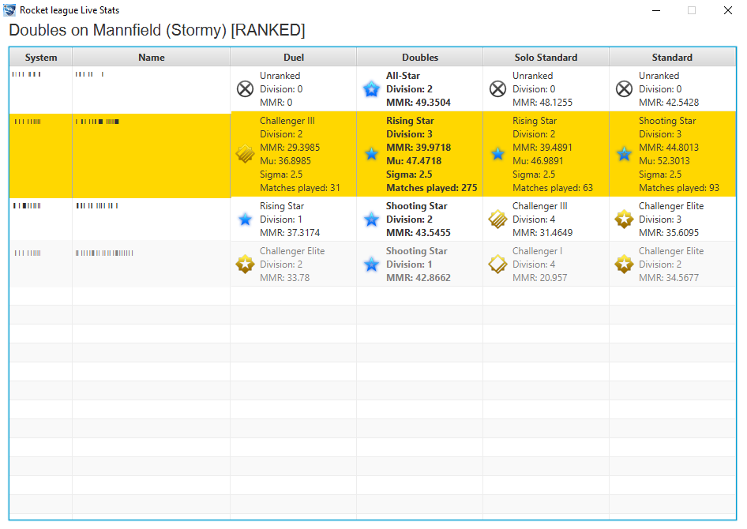

# rocketleaguelivestats

This awesome sauce tool allows you to checkout the ranks of your opponents while you play!

This is how it looks like: 

[Downloads](https://github.com/ExcuseMi/rocketleaguelivestats/releases)
Download the jar file and double click it. You need to have java 8 installed.
Note:
You need to have the game running to able to display the ranks of all the players in your current game.
